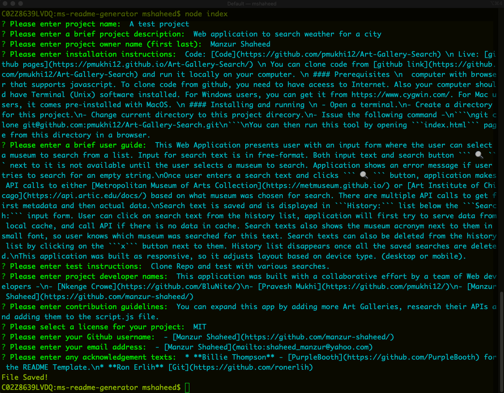
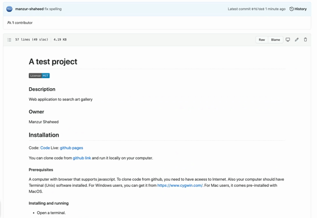

# ms-readme-generator

Command line interface application to create a project readme markdown file.
## Installation
Code: [Code](https://github.com/manzur-shaheed/ms-readme-generator) 

You can clone code from [github link](https://github.com/manzur-shaheed/ms-readme-generator) and run it locally on your computer. 
#### Prerequisites 
A computer with browser that supports javascript for adhoc js command testing, ```node.js``` and ```npm``` (node package manager). To clone code from github, you need to have aceess to the Internet. Also your computer should have Terminal (Unix) software installed. For Windows users, you can get it from https://www.cygwin.com/. For Mac users, it comes pre-installed with MacOS. 
#### Installing and running 
- Open a terminal.
- Create a directory for this project.
- Change current directory to this project direcory.
- Issue the following command -
```
git@github.com:manzur-shaheed/ms-readme-generator.git
```
- If you don't have ```node.js``` installed already then download it from [here](https://nodejs.org/en/download/), and follow the instructions to install it.
- Once installed, use ```npm``` to install ```inquirer``` package by issuing ```npm i inquirer``` command at the terminal prompt.
- You can run this program by issuing ```node index.js``` command. Below is a snapshot of how I ran to produce a new readme file. A new readme file ```new_readme.md``` will be created in the same directory.



Here is new readme file (I had to put line feeds there as ```\n``` didn't work properly).



## Testing
Please follow installation instructions and then run ```node index.js``` for various scenarios.
## Contribution Guidelines
You can expand this app by adding more questions to the ```questions.js``` file. Please note that if you modify ```questions.js``` file, then you will need to adjust ```generateMD.js``` file to cater for the chnages you made. Also you can try to investigate how to add markdown meta characters to your answers, how to add multiline answers, so you don't have to edit new readme file and use it straight way.
## License
MIT License

Copyright (c) 2021 Manzur Shaheed

Permission is hereby granted, free of charge, to any person obtaining a copy of this software and associated documentation files (the "Software"), to deal in the Software without restriction, including without limitation the rights to use, copy, modify, merge, publish, distribute, sublicense, and/or sell copies of the Software, and to permit persons to whom the Software is furnished to do so, subject to the following conditions:

The above copyright notice and this permission notice shall be included in all copies or substantial portions of the Software.

THE SOFTWARE IS PROVIDED "AS IS", WITHOUT WARRANTY OF ANY KIND, EXPRESS OR IMPLIED, INCLUDING BUT NOT LIMITED TO THE WARRANTIES OF MERCHANTABILITY, FITNESS FOR A PARTICULAR PURPOSE AND NONINFRINGEMENT. IN NO EVENT SHALL THE AUTHORS OR COPYRIGHT HOLDERS BE LIABLE FOR ANY CLAIM, DAMAGES OR OTHER LIABILITY, WHETHER IN AN ACTION OF CONTRACT, TORT OR OTHERWISE, ARISING FROM, OUT OF OR IN CONNECTION WITH THE SOFTWARE OR THE USE OR OTHER DEALINGS IN THE SOFTWARE.
## Contacts
#### Github
- [Manzur Shaheed](https://github.com/manzur-shaheed/)
#### Email
- [Manzur Shaheed](mailto:shaheed_manzur@yahoo.com)
## Acknowledgements
* **Billie Thompson** - [PurpleBooth](https://github.com/PurpleBooth) for the README Template.
* **Ron Erlih** [Git](https://github.com/ronerlih) for coding idea.
